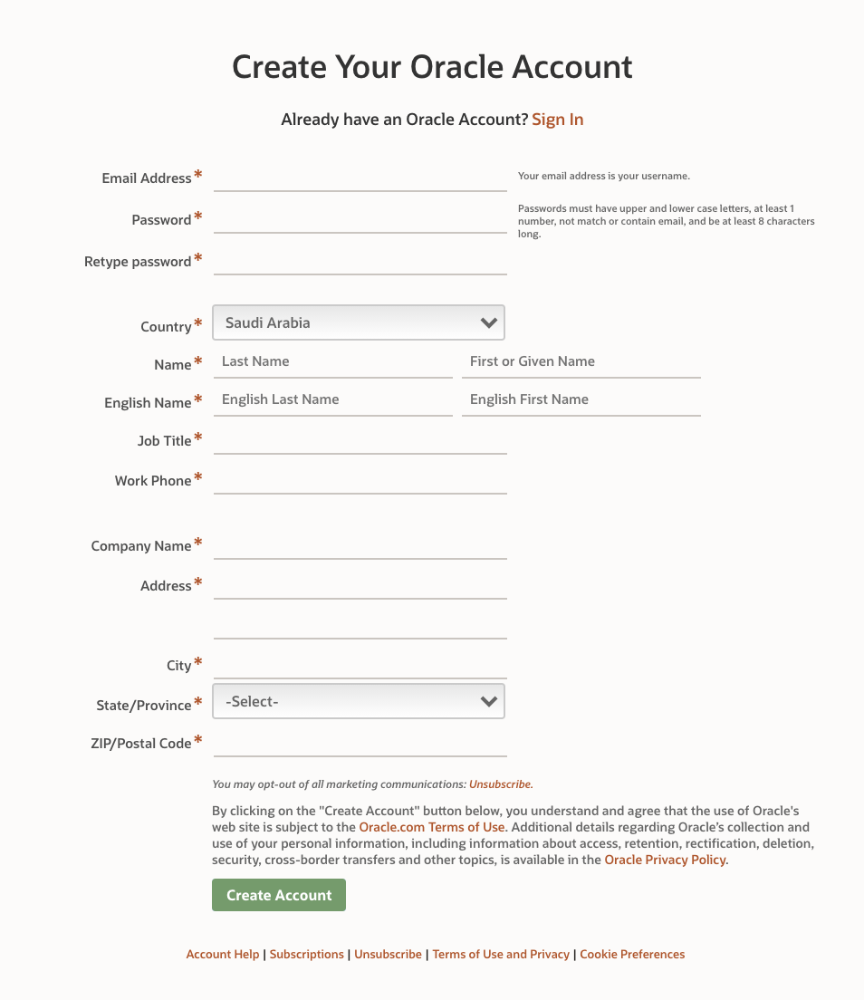
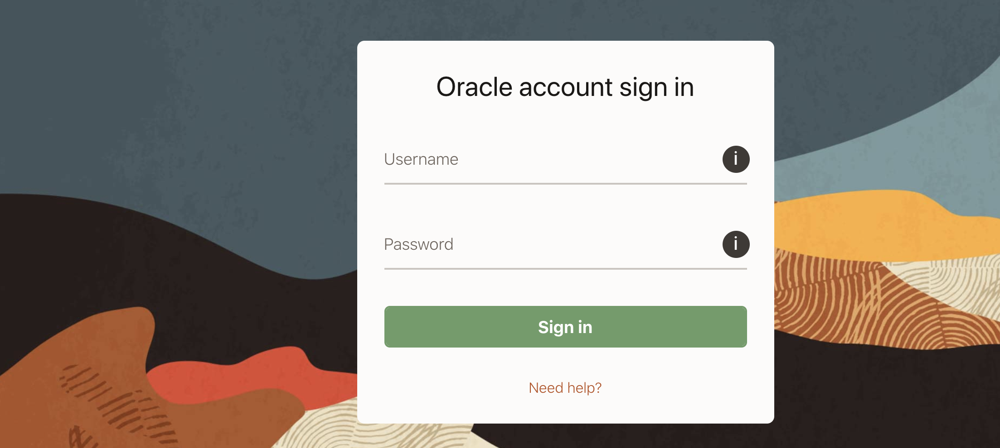
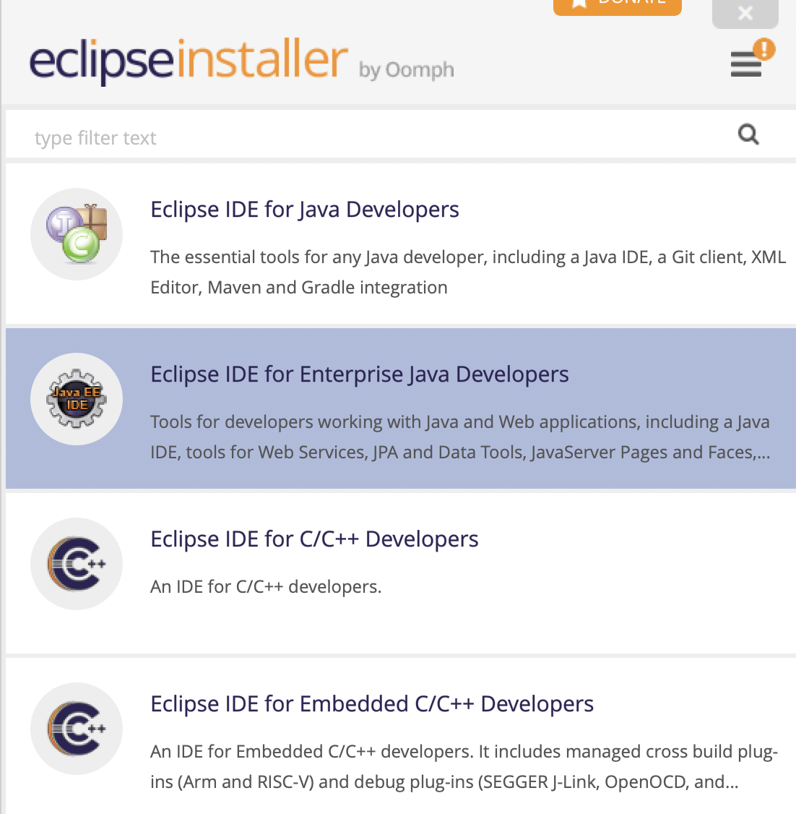
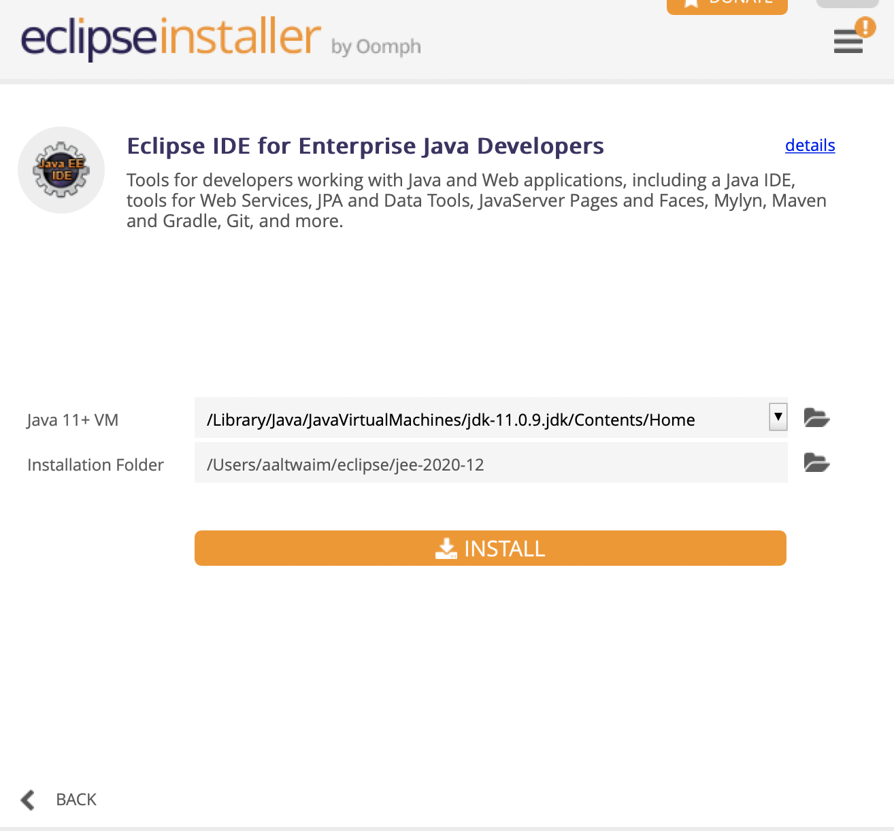

# Installing JDK and Eclipse

## JDK 11 (Java SE Development Kit)

1- Create an account on [Oracle](https://profile.oracle.com/myprofile/account/create-account.jspx)

Make sure to verify your account from your email

2- Log in to your [Account](https://login.oracle.com/mysso/signon.jsp)

The username is your email address

3- Go to this link [JDK11](https://www.oracle.com/sa/java/technologies/javase-jdk11-downloads.html).

Make sure to choose macOS Installer

Then install the JDK on your computer.

## Eclipse

1- Go to [Eclipse](https://www.eclipse.org/downloads/download.php?file=/oomph/epp/2020-12/R/eclipse-inst-jre-mac64.dmg)

Download the Eclipse installer then open it

2- Choose Eclipse IDE for Enterprise Java Developers

3- Then install Eclipse IDE

