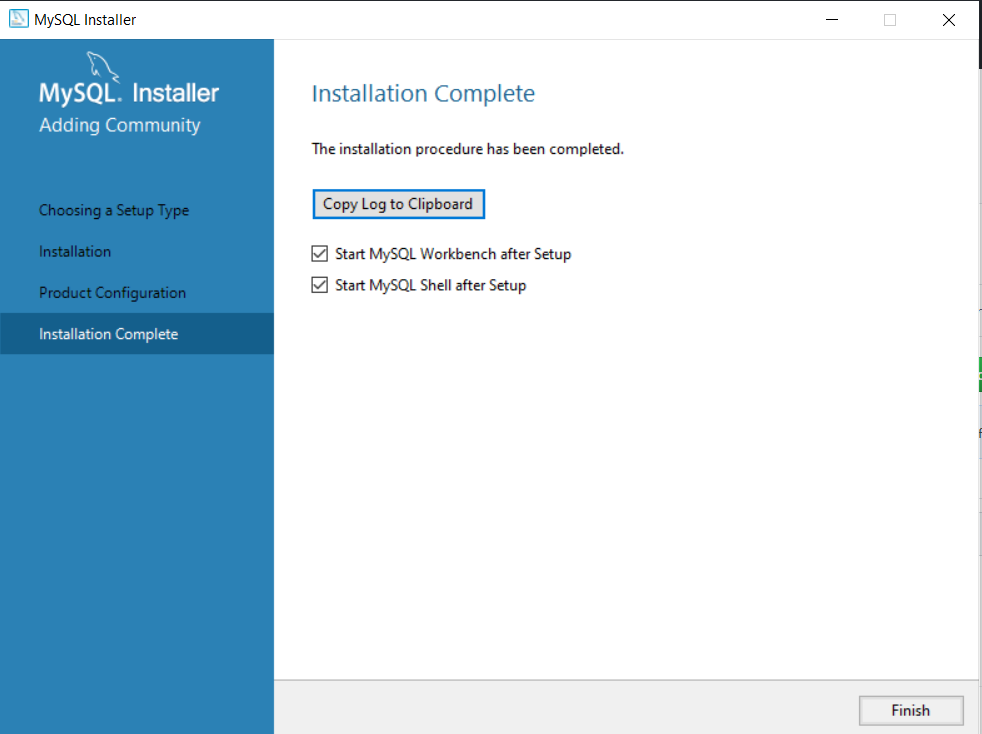
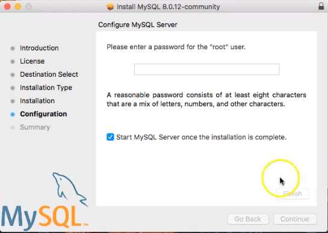

# MySQL-downlaod-steps
# What is MySQL

1. MySQL is a database management system.

1. MySQL databases are relational.

1. MySQL software is Open Source.

## Go to https://www.mysql.com/downloads/

## For windows users Important
MySQL Community Server requires the
Microsoft Visual C++ Redistributable Package to
run on Windows platforms. Users should make
sure the package has been installed on the
system before installing the server. The package
is available at the
https://visualstudio.microsoft.com/downloads/

Choose MySQL-installer-community

Click run

Choose Developer Default

Execute

## For Mac users 

Choose MySQL community server 

Click No thanks, just start my download

Go back to install Workbench

For workbench : drag and drop to applications

