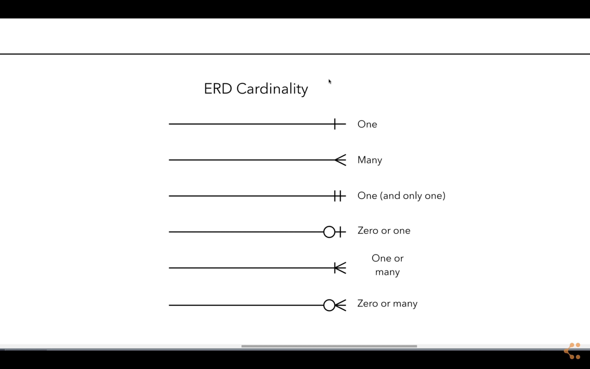
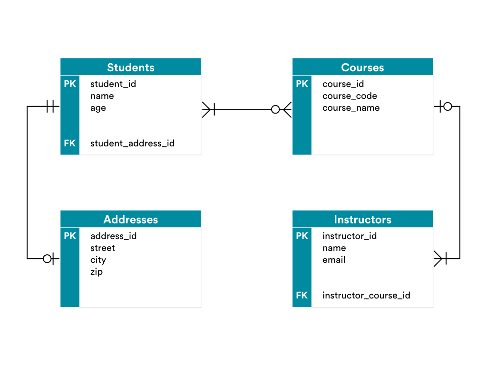

#  Relational Database Modeling

## Introduction

[Entity Relationship Diagram](https://www.visual-paradigm.com/guide/data-modeling/what-is-entity-relationship-diagram/), also known as ERD, ER Diagram, or ER model, is a type of structural diagram for use in database design. An ERD contains different symbols and connectors that visualize two important information: The major entities within the system scope, and the inter-relationships among these entities.

And that's why it's called "Entity" "Relationship" diagram (ERD)!

We'll use crow's foot notation to create entity relationship diagrams (ERDs) that represent relational database models.

### Let's Work on an Example Together 

Together as a group we will create an ERD of the database we built yesterday for General Assembly. 

Let's first list out all the entities we created:

- Student
- Address
- Instructor
- Course

We can use ERD Cardinality for reference.

Here's what it should look like in the end.

------

## Lab: Practice Database Design

Say you run a tire store. You have a spreadsheet of your tire inventory. You sell 16 different models of tires in different sizes from three vendors: Michelin, Bridgestone, and Pirelli. You have more than a thousand tires in your inventory. 

You can get started with [this spreadsheet](Tire-Store.xlsx). Note that tire sizes are always listed as a combination of `width`, `aspect ratio`, and `diameter`.
 
Describe how you would convert your spreadsheet into a relational database model so that: 
1. Vendor names `Michelin`, `Bridgestone`, and `Pirelli` are listed once, not repeated many times in many rows and tables.
1. Tire models are listed once, not repeated many times in many tables.
1. Tire size combinations (`width`, `aspect ratio`, `diameter`) should also only be in one table (not repeated many times). (Hint: There are actually seven sizes in the spreadsheet.(

Solution: 
> - One table called `Vendor` with three rows — one for each vendor.
> - One table called `Model` with 16 rows — one for each model.
> - One table called `Size` with seven rows — one for a tuple of (`width`, `aspect ratio`, `diameter`).
> - One table called `Inventory` with a maximum of 3x16x7 rows. Each row has a relationship to `Vendor`, `Model`, `Size` (i.e., foreign keys) and an integer for `Quantity in Stock`.

__Bonus__: Design your model so that it would be impossible for a user to enter invalid vendor-model pairs into your inventory. For example, invalid pairs would be (`Pirelli`, `Ecopia`) or (`Michelin`, `Nero`).  

> **Instructor Note**: There are at least a couple of ways to complete this bonus question. One way is to combine `Vendor` and `Model` into one table. If you do this, your data would not be normalized, because you'd be repeating the `Vendor` name many times, but maybe that's OK. Another way is to create a new table, called `VendorModel`, which relates only valid `Vendor` and `Model` rows to each other. Then, each row of `Inventory` would relate to `VendorModel`, instead of `Vendor` and `Model` separately.    

___Deliverable___

An ERD, using crow's foot notation, of whatever app you choose. For example:

> **Note**: This example has "items" as placeholders for the attributes.

### Additional Resources

- [Crow's Foot Notation Cheat Sheet](http://www.vivekmchawla.com/content/images/2013/Dec/ERD_Relationship_Symbols_Quick_Reference-1.png)
- An Extra-Relevant [Resource for Students](https://developer.mozilla.org/en-US/docs/Web/Events)

