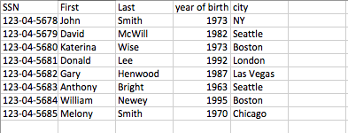

#  SQL JOINs Lab

## Introduction

> This should be done independently.

In this lab, you'll write SQL scripts for PostgreSQL that will create and initialize a database with two tables (`Employee` and `Job`) and then query the data in those tables. 

The `Employee` table contains the following data:  

<p align="center">
    
</p>

The `Job` table looks like this:  

<p align="center">
     
</p>

The main purpose of our scripts is to query information from both tables:  

1.  Show the full names of employees working at Macy's.
2.  Show the companies located in Boston.  
3.  Show the full name of the employee with the highest salary.  

-------

## Exercise

### Requirements

1. Connect to MySQL using Wroekbench

2. Create database company `CREATE DATABASE company`

3. Connect to the newly creates database `\c company`

4. Create table `employees` where `ssn` is the primary key.

5. Create table `jobs` such that `ssn` is a foreign key referring to `employee` table column `ssn`
> What relationship do employees-jobs tables have? Look at the image to find your answer.
6.  Add data to the tables using the csv files given in [starter-code](./starter-code)

```
COPY employees(ssn,first_name,last_name,year_of_birth,city) FROM '/Users/<your-username>/Desktop/employees.csv' DELIMITER ',' CSV HEADER;

COPY jobs(ssn,company,salary,experience) FROM '/Users/<your-username>/Desktop/jobs.csv' DELIMITER ',' CSV HEADER;
```

Write select queries for each of the following:
  1. **Employees working at Macy's**: The full names of employees working at Macy's.
  1. **Companies in Boston**: The companies located in Boston.
  1. **Employee with the highest salary**: The full name of the employee with the highest salary.

> Note: Those two files can call other files if you'd like.

### Deliverable

A pull request with a sql file that has all queries.
