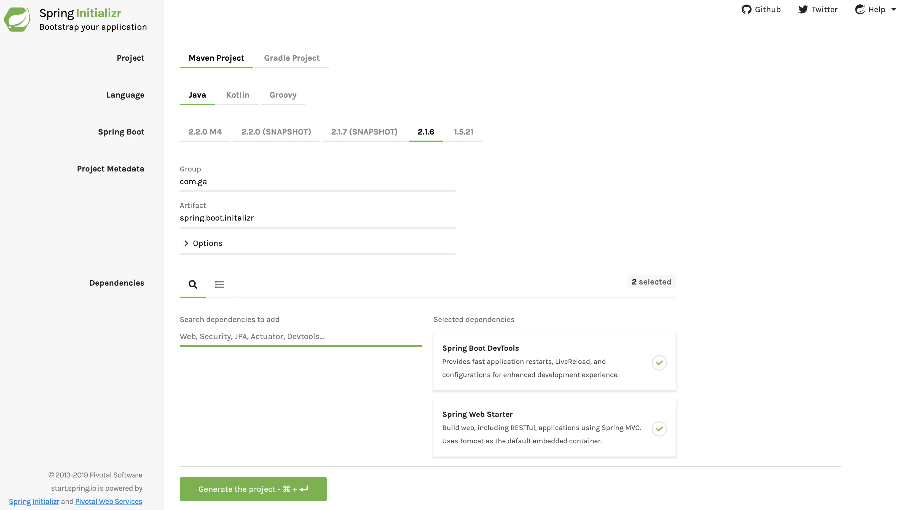

#  Spring Boot

## LEARNING OBJECTIVES

*After this lesson, you will be able to:*
- Create a Spring Boot project.
- Identify the important components of a Spring Boot app and what they do.
- Create a Controller and define routes for data from an API.

## LESSON GUIDE

| TIMING  | TYPE  | TOPIC  |
|:-:|---|---|
| 5 min  | Opening    | Discuss lesson objectives |
| 15 min | Exercise   | Setting Up a Spring Boot Project  |
| 20 min | Guided Practice | Exploring a Spring Boot App   |
| 15 min | Guided Practice | Creating an API in Spring Boot |
| 5 min  | Conclusion | Review / Recap   |

## Introduction (5 min)

Spring Boot is a modern, opinionated Java web framework. Leveraging libraries from a larger Spring ecosystem, Spring Boot provides a quick and easy to way to bootstrap and maintain Java webapps. It is highly extensible, with a large number of plug-and-play Spring packages available to add functionality such as Web Sockets and cloud capabilities.

> Sidebar: You may hear the term "opinionated" used to describe a web framework or tool. This just means that it has a specific set of best practices and conventions that it follows and enforces on your work. This is a good thing! It's meant to speed up development time and improve the quality of your code.

Spring Boot does not replace Spring MVC, Spring REST, or any other Spring technology. Instead, Spring Boot utilizes these and uses some fairly unique design patterns when compared to other popular frameworks such as Ruby on Rails or Node's Express framework.

Spring Boot does not give better performance over regular Spring code, but it minimizes configuration and is easier to get started.

---

## Setting Up a Spring Project (20 min)


### 1. Spring Initializr

- Go to [Spring Initializr website](https://start.spring.io/)  

- Create a Maven project. Provide the Group, Artifact names and dependencies as shown in the image below.



- Click on Generate Project button. This will download the project. Unzip it and move it to your desired location. 


## Exploring our Spring Boot App (20 min)

Let's `cd` into the new `spring-boot-monolith` folder and take a look around. We can easily open the project in Eclipse IDE by running.

The generator created a bunch of files and folders for us, but we'll only need to focus on a few:

### `/src`

All of our code will live inside of the `/src` directory. There are two important packages nested in this directory that we'll focus on:

- The `main.java.com.example.springbootmonolith` package will house our application code. 
- Our application and database set-up files will live inside of the `main.resources` package.
- The `test` package will house all of our tests. As we build out our application code, we'll create corresponding files and folders in the `test` package.

### `main`

Inside of our `main` package is a `DemoApplication.java` file. This file has two simple components that will allow us to run the app out of the box. 

- The first is the `@SpringBootApplication` annotation at the very top. This Java annotation will allow our app to bootstrap itself and tie all of our classes together.
- The second is a generic `main()` method, just like any other Java application. This method uses a provided `SpringApplication.run()` method to start up our application.

### `pom.xml`

In the root folder of our app, we'll find some other important files:

- The `pom.xml` file will manage the life cycle of our application. We can add and remove dependencies using this file. We can also build, run, and deplioy our application using this file.

Run the main method in `DemoApplication.java`. If the server starts successfully, you will see a log `Tomcat started on port(s): 8080` on console. 

By default, a Spring Boot app runs on port 8080. Go to [http://localhost:8080](http://localhost:8080), which is how you access your app. You should see the following error message on the page:

```
Whitelabel Error Page
This application has no explicit mapping for /error, so you are seeing this as a fallback.
```

> Note: In case you see `8080 already in use` error, kill the process running on port 8080 as per the instructions [here](https://stackoverflow.com/questions/11583562/how-to-kill-a-process-running-on-particular-port-in-linux) and start the server again.

### Spring Boot Dev Tools

"Hot Reloading" has become a staple of modern web development tools. It can be painful to have to manually stop, rebuild, and restart your application every time you make a small change, especially when using a compiled language like Java. Spring Boot provides this functionality in a set of easy to use developer tools that we can add to our application with a single line of code. 

Let's go back to our `pom.xml` file and add one more line inside the `dependencies` tag: 

<b>pom.xml</b>

```maven
<dependencies>
....
....
	<dependency>
		<groupId>org.springframework.boot</groupId>
		<artifactId>spring-boot-devtools</artifactId>
		<scope>test</scope>
	</dependency>
</dependencies>
```


We've now completed the basic setup of our Spring Boot environment!

----

## Creating an API with Spring Boot (15 min)

Now that our basic set up is done and our app is running, let's create a simple route.

Spring Boot, like many web frameworks, is built on top of the ubiquitous MVC pattern. APIs built in Spring Boot need to model and persist data from a database and receive and respond to client requests. 

### The Controller

The first thing we need is a Controller. We need controllers to manage our traffic. This is where we define our routes.

Let's create a new `UserController` to start serving up our `User` data. To get started, we'll need to create a new `controller` package. Inside of this new package, we'll create a class called `UserController.java`.

Spring Boot Controllers are simply Java classes with an annotation at the top that adds special functionality. In our `UserController`, let's set up a new class with the `@RestController` annotation.

<b>UserController</b>

```java
package com.example.springbootmonolith.controller

import org.springframework.web.bind.annotation.RestController;

@RestController
public class UserController {

}
```

> Tip: To automatically import the package containing RestController, place the cursor on it and Press	⌥ ⏎ to accept the suggestion.

If there's more than one possible source of import, pressing ⌥⏎ will open the list of suggestions.

The **@RestController** annotation was introduced in Spring 4.0 to simplify the creation of RESTful web services. It’s a convenience annotation that combines @Controller and **@ResponseBody**, which eliminates the need to annotate every request handling method of the controller class with the **@ResponseBody** annotation

This is all we need to start turning our Spring Boot app into a REST API! 

### Adding a Route

Let's add our first route to the application. It will be simple route to get a String in response.

```java
import org.springframework.web.bind.annotation.GetMapping;

public class UserController {

	@GetMapping("/hello")
	public String helloWorld() {
		return "Hello World!!";
	}
}
```

The **@GetMapping** annotation tells the server to listen for `GET` requests at `/hello` endpoint. The method `helloWorld()` runs whenever this `GET` request is made, and we have set it up to return a String. If we start up the server and take a look at [http://localhost:8080/hello](http://localhost:8080/hello), we'll see that a String is returned. With just two annotations, everything is wired up!

----

## Conclusion (5 min)

Spring Boot is a fully-featured, "batteries-included" framework. Without searching for outside tools, we are able to bootstrap an application, and expose routes for our users to call. But as you already know, just having a route in our app is not enough. In our next lesson, we will see how we can persist our data in a database.

Although some of the embedded design patterns are unique, anyone familiar with MVC patterns and Java can get up and running quickly with Spring Boot.

#### Further Reading

- [Difference between Spring MVC and Spring Boot](https://stackoverflow.com/questions/32922914/difference-between-spring-mvc-and-spring-boot)  

