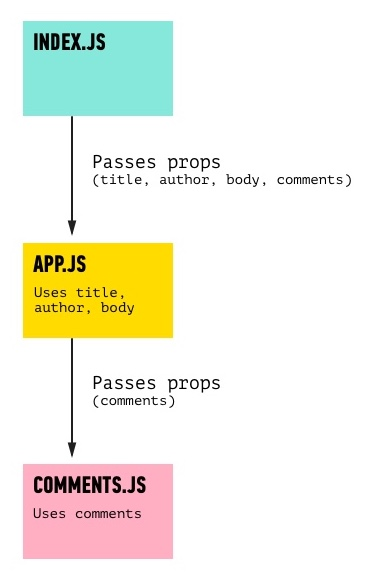

#  Nested Components


### Learning Objectives
*After this lesson, you will be able to:*
- Diagram nested components
- Render components within another component
- Pass props to a nested component

## We Do: Nested Components

In your blog, a section of your `App.js` `render` function currently looks like this:
```html
<h3>Comments:</h3>
<p>{this.props.comments[0]}</p>
```

While you can certainly display more comments with `<p>{this.props.comments[1]}</p>`, `<p>{this.props.comments[2]}</p>`, etc, do you think this is the best way?

It would be a pain to have to explicitly define every comment when rendering `<Post />`, especially if each comment had multiple properties.

This problem is a telltale sign that our separation of concerns is being stretched, and it's time to break things into a new component.

To solve this problem, in the following slides we will **nest** `Comment` components within a `Post` component.

We can create these comments the same way we created posts: By defining a `Comment` class that `extends Component` and has a `render` method.

Next, we'll put comments inside an individual post component. To do this, we can reference a comment using `<Comment />` inside of `Post`'s `render` method.

* Starting from the blog post code, let's create a new file for a `Comment` component, `src/Comment.js`:

```jsx
import React, {Component} from 'react';

class Comment extends Component {
  render () {
    return (
      <div>
        <p>{this.props.body}</p>
      </div>
    );
  }
}

export default Comment;
```

What have we done?

* We've defined our component class, which inherits from `React.Component`.
* We're exporting this `Comment` class by default for anything importing this file.
* We are returning JSX that contains a paragraph displaying a `body` prop (which will be passed in).

Now, in `src/App.js`, we need to import our `Comment` component so it's available to the `Post` component class.
* Change the top of `App.js` to include the new class:

```js
import React, { Component } from 'react';
import './App.css';

// Load in Comment component
import Comment from './Comment.js';
```
With this setup, we can render one or more comments inside the `Post` component. Currently,
`<p>{this.props.comments[0]}</p>` is rendering one comment in the `Post` component from `App.js`. Now, instead of this line, we'll want to render a `Comment` component (which renders a paragraph with the comments, so it will look the same!).
* Edit that line to render a comment instead of directly rendering a paragraph.  Make sure you send through the `body` prop that the `Comment` component class needs:

```js
<Comment body={this.props.comments[0]} />
```

Let's reflect on what just happened. We rendered a component _inside another component_. Technically, we just **nested** components. Very much like how we imported `Post` from `App.js` into `index.js` and rendered a post inside `index.js`, we've imported `Comment` from `Comment.js` into `App.js` and rendered a comment. Inside `App.js`, we're using some of the props to render a post and simply passing the `comments` prop on to be rendered with the `Comment` component class. So the flow of the props looks like this:





### To get a little more advanced...

That's nested components! What we're about to look into is just the idea of calling an object during the `render` `return` method - and that object can have component calls in it.

##### What we did:

`<Comment body={this.props.comments[0]} />` passed just the first object in the `comments` array

##### What we can do:

We can also simply pass a variable as a parameter. For example, we could pass the whole `comments` array with `<Comment body={comments} />`. We can also just write a JavaScript expression if we put it inside brackets. For example, if I had an object inside my `App.js`, each row of the object could individually call the `Comment` component.

* Following along here is optional! This is to demonstrate a shorthand way of writing what your code already does.

```js
class Post extends Component {
  render() {
    const allComments = [
      <Comment body={this.props.comments[0]} />,
      <Comment body={this.props.comments[1]} />,
      <Comment body={this.props.comments[2]} />
    ];
    /// rest of content .....
  }
}
```

> Why is this variable declared in the `render` method? Because this calls the `Comment` component, which will render UI within it. The `render` method is where all UI goes!

We could call then call this object inside our `return` JSX with `{allComments}`, which would then call all three of those <`Comment />` statements:

```html
<div>
  <h1>{this.props.title}</h1>
  <p>by {this.props.author}</p>
  <div>
    <p>{this.props.body}</p>
  </div>
  <h3>Comments:</h3>
  {allComments}
</div>
```

 * *Note: We could have put all of our code in one file, but it's a good practice to break components out into different files to help practice separation of concerns. The only downside is that we have to be extra conscious of remembering to **export / import** each component to the file where it's rendered.*
