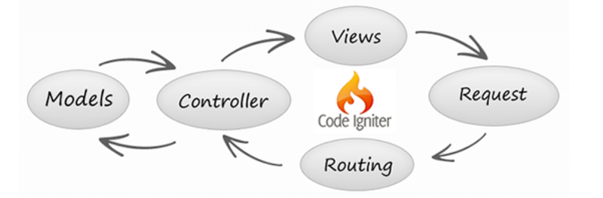

#  Connecting Spring Boot and React

### Learning Objectives

At the end of this lesson, students will be able to:
- Take a bootstrapped Spring Boot application and expose it as an API.
- Use a front-end React application to receive and display data from a Spring Boot API.
- Explain how routing to a back-end API works.
- Describe CORS and correct configuration.

## Opening

In this lesson, we’ll explore what a back-end API is and how to expose and consume it.

### First Things First: Reviewing APIs

An **application programming interface** (API) is a fancy way of saying, "something that responds to a request with data."

> **Knowledge Check**: Can someone explain the MVC concept?

Answer

MVC is a programming concept that explains how data goes from the view to the controller, then to the model and back to the controller, then to the view and back to the controller, and so on.

Let's explore this concept a bit further with an example. Let's say we're creating an app that lists the most sold books on Amazon. 

A user clicks on a button that links to a route. To simplify things, we'll say that no data is being transmitted, and the button doesn’t actually do anything yet.

The user clicks on a button that sends a `GET` request to `localhost:3000/api/books`. In your controller, you have a method listening to the `/api/books` route and waiting for a `GET` request.

Your application sends a request, which is caught by the controller. In the controller, your method sends the packet to a model. From there, the model performs a query on the database and sends data back to the controller, which then responds to the view.

The entire system sits and waits for the next button click. In the end, that's what an API is: an endpoint sitting and waiting for a request to come in.

-------

## Intro to Routing

> **Sidebar**: The way you route your controller to your model is the same way you route your front-end React application to your back-end Spring Boot application.

The concept of routing is one of the few times a technical term explains almost precisely what it's doing.

When you send your request to `localhost:3000/api/spring-react`, your computer internally sends a packet (a collection of zeros and ones) to an address in memory associated with it, which is a controller that contains a number of methods when using an MVC framework.

When the packet reaches its destination, it's then routed to the next destination — the model — based on the method in the controller that handles the route. From there, the packet triggers a database query and typically responds with information of its own. In this case, because we're just sending a simple `health check` query, the database responds with `ok`, which is routed back to the controller. The controller then responds to the button click with a `200` status ("All clear, I'm up and running").

This concept can be as simple as our example above or can be scaled up to handle the one million or so queries a second that Facebook's API handles.

-----

## Connecting React to Spring Boot

But how does this work when you're not linking one file on a computer to another file on the same computer? Along with that, what happens when you're hitting an endpoint miles away or when, in our example, you're using two entirely different programming languages?

The answer: It works the exact same way. (Well, not entirely, but that's a conversation for a different lesson.) 

When you go to your browser and type `https://www.google.com`, your computer goes to your local DNS, which turns those human-readable words into machine-readable words (something like `127.09.123.45`, which is completely made up). Think of the DNS as a phone book: It contains the name and the associated number to which to connect.

Your little packet of information goes to the DNS and is **routed** to the correct server, which has a controller set up and listening for requests. When it receives your request, it routes your request to the associated model, which in turn responds with a number of files (HTML, CSS, JavaScript, a few SVG images, and more).

The controller receives those files and routes them back to your computer, which is patiently (if only humans were as patient as computers) waiting for a response. Your computer receives both a `200` response ("Everything is OK. I worked!") and the files. From there, your front-end displays the Google SVG image of the day, an HTML input search bar, any associated JavaScript methods for the event handlers, and some basic CSS to make the whole page look decent.

<b>Knowledge Check</b>: Where does React fit into the MVC paradigm?

React is the **view**. It's only concerned with displaying information, taking user input, and routing it to the appropriate place.

As we learned in previous lessons, React does a lot of interesting things under the hood. But still, React only cares about displaying data and sending requests to the website's back-end API.

Knowing this, we can understand that Spring Boot is **both the model and the controller**. Only now, instead of routing internally, you'll be routing to separate folders. With that knowledge, you'll be able to route to separate sites, languages, countries, and even worlds.

When the folks at NASA wants the Curiosity Rover to pick up a sample of Martian dirt, what do you think they are doing? Sending a request to the Rover's exposed server, which then sets the scooper in action.

------

## CORS 

> "**Cross-origin resource sharing** (CORS) is a mechanism that uses additional HTTP headers to tell a browser to let a web application running at one origin (domain) have permission to access selected resources from a server at a different origin. A web application executes a cross-origin HTTP request when it requests a resource that has a different origin (domain, protocol, or port) than its own origin."

> Click on this [source](https://developer.mozilla.org/en-US/docs/Web/HTTP/CORS) for a plethora of information.

So what does this all mean? For safety, the web blocks requests from different origins by default. Rather than being exposed, they close them off. It would be like your favorite restaurant locking its doors all day and you having to get a special key to unlock it and get in.

------

## Conclusion 

With a partner, come up with an "Explain it like I'm 5" answer for these questions:

- What is an API?
- What is a high-level explanation of routing?
- Explain how MVC works in the context of React.
- Describe how routing to a back-end API works.
- Describe what CORS errors are and how to avoid them.
