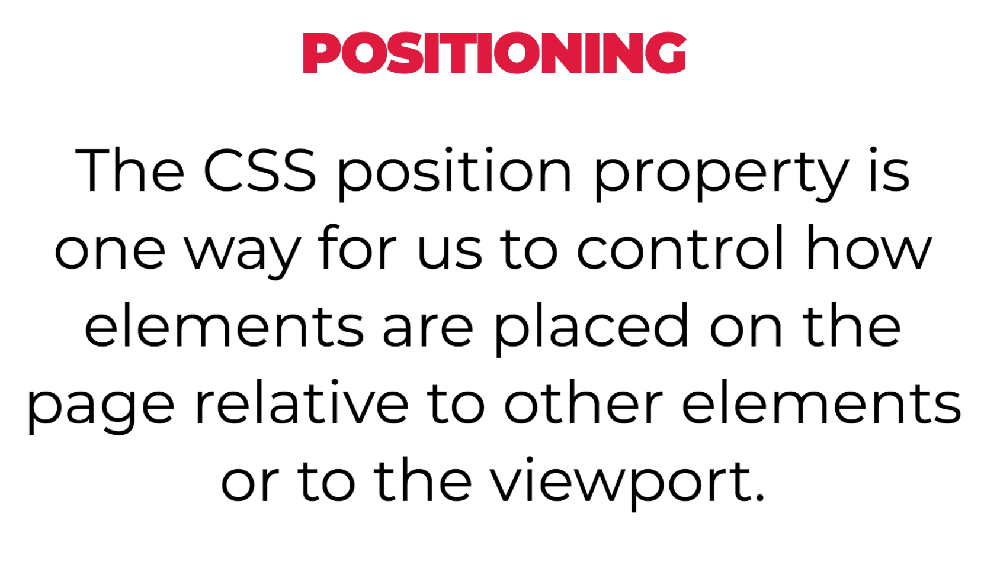

# CSS Positioning

## Objectives

By the end of this, developers should be able to:

- Identify the position property of an element
- Use static, relative, absolute, and fixed positioning for page layout

### [View Codepen Example of Position Relative](https://codepen.io/MicFin/pen/ZWzxWx)

### [View Codepen Example of Position Absolute](https://codepen.io/MicFin/pen/grYeMP)

### [View Codepen Example of Position Fixed](https://codepen.io/MicFin/pen/bpbveg)

## Activity: Turn and Talk (15 mins)

## Lab: CSS Position Ice Cream

- [Read this article](https://medium.freecodecamp.org/css-positioning-explained-by-building-an-ice-cream-sundae-831cb884bfa9)

- [Complete this exercise](https://www.codeanalogies.com/csssundae)

## Additional Resources

- https://cssreference.io/positioning/
- https://internetingishard.com/html-and-css/advanced-positioning/
- http://learnlayout.com/toc.html
