[](https://generalassemb.ly/education/web-development-immersive)

# Responsive Web Design

## Objectives

By the end of this talk, developers should be able to:

- Use % width for responsive web design
- Write media queries for responsive web design
- Describe mobile first development

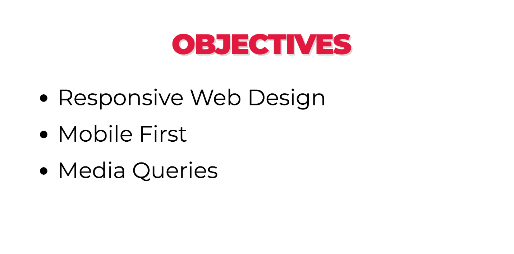

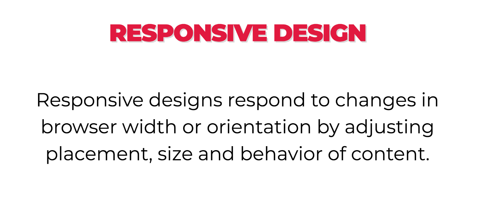

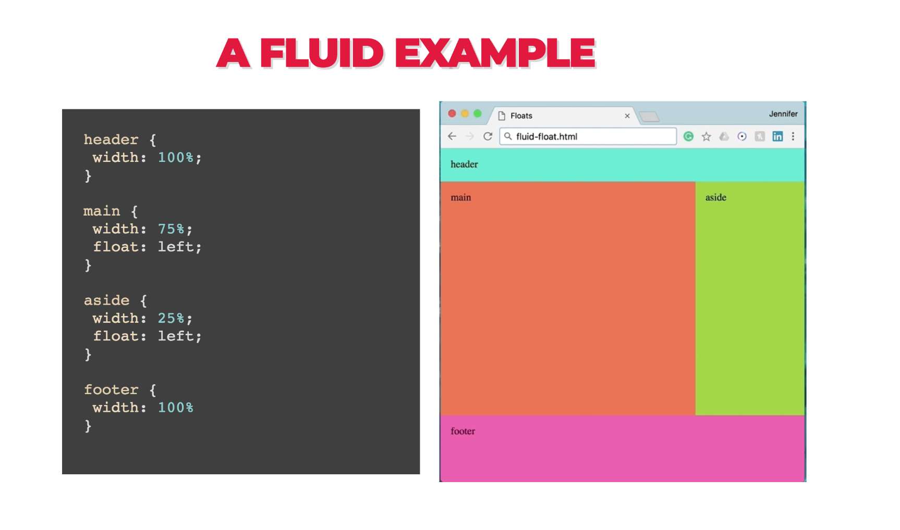

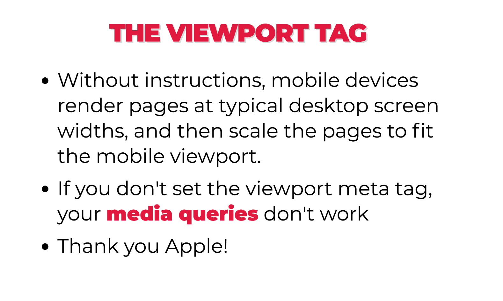

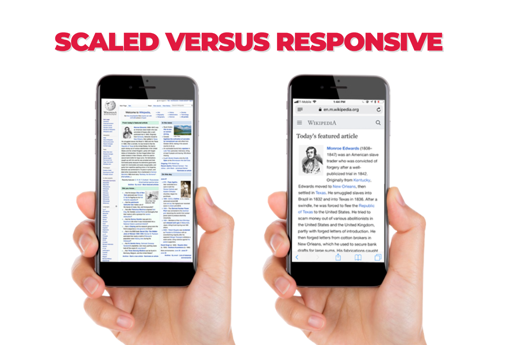

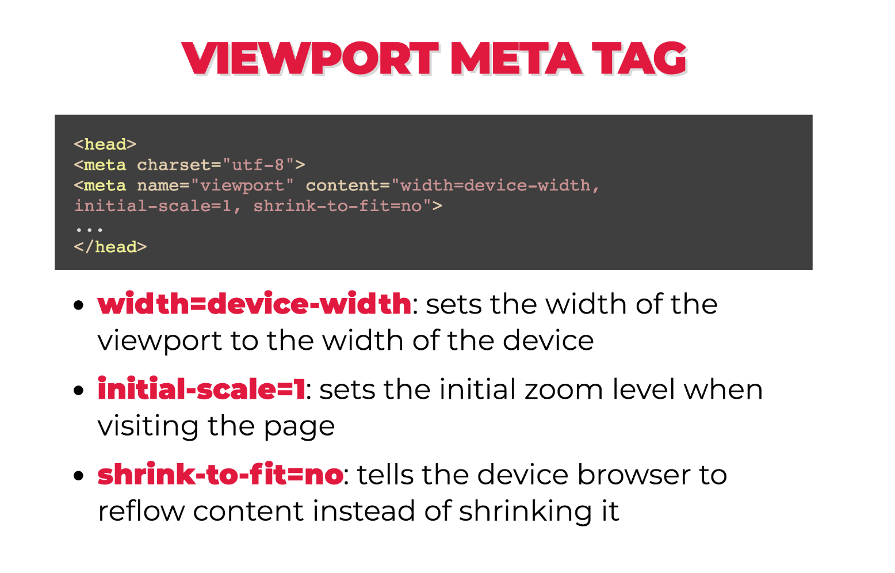

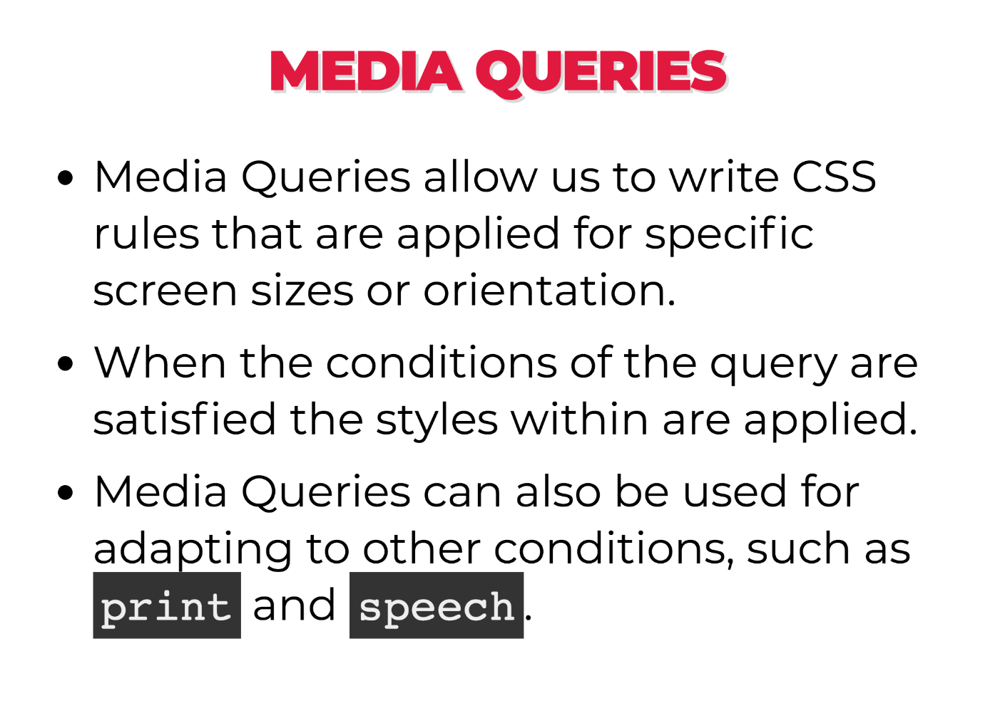

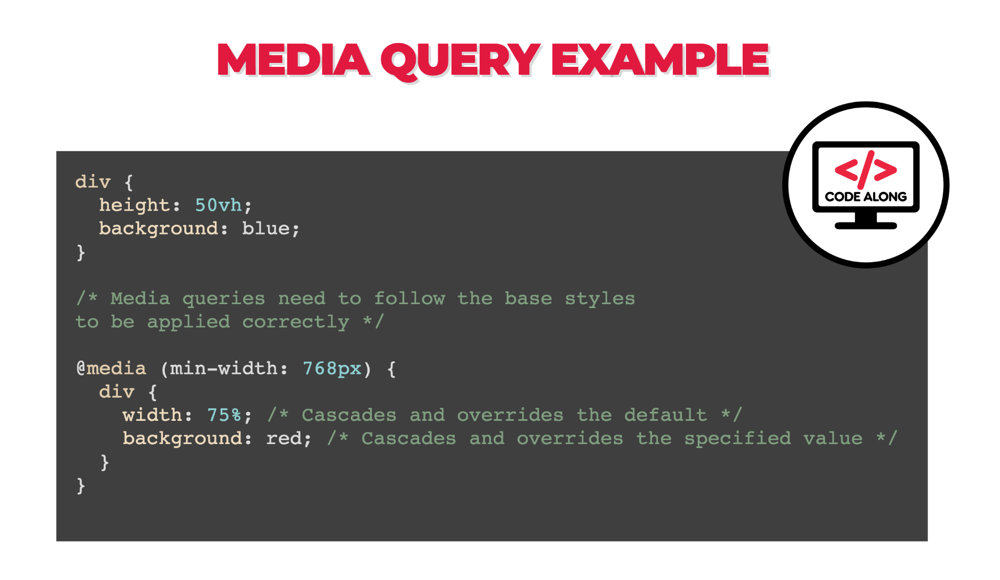

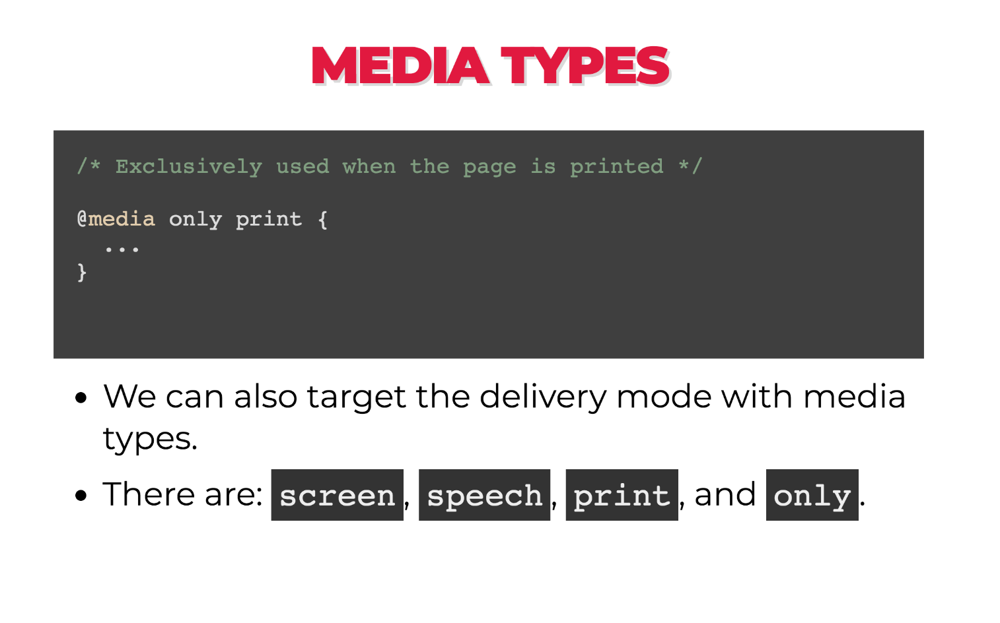

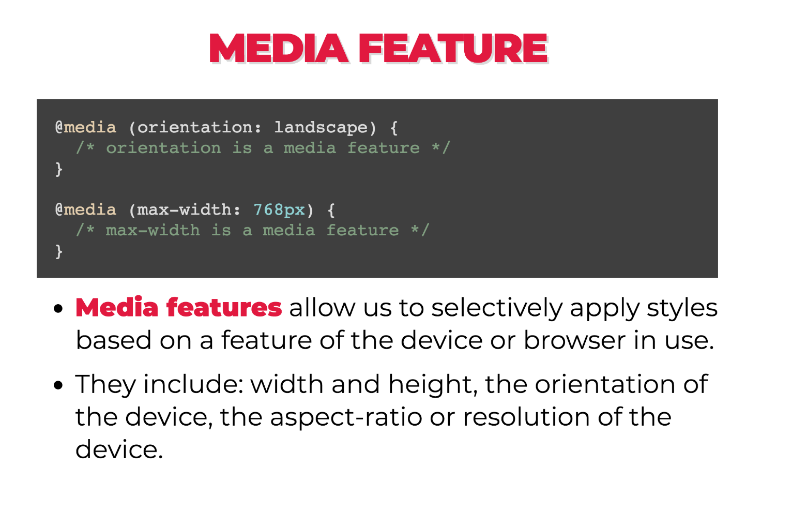

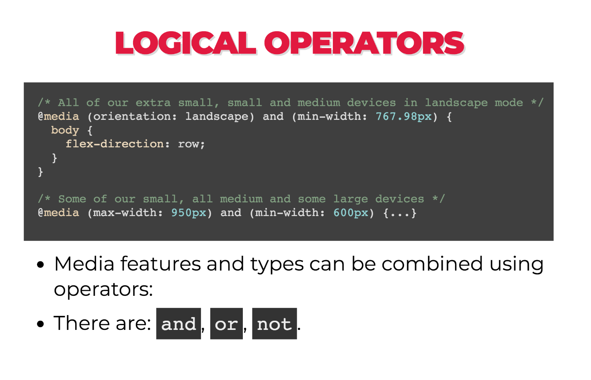

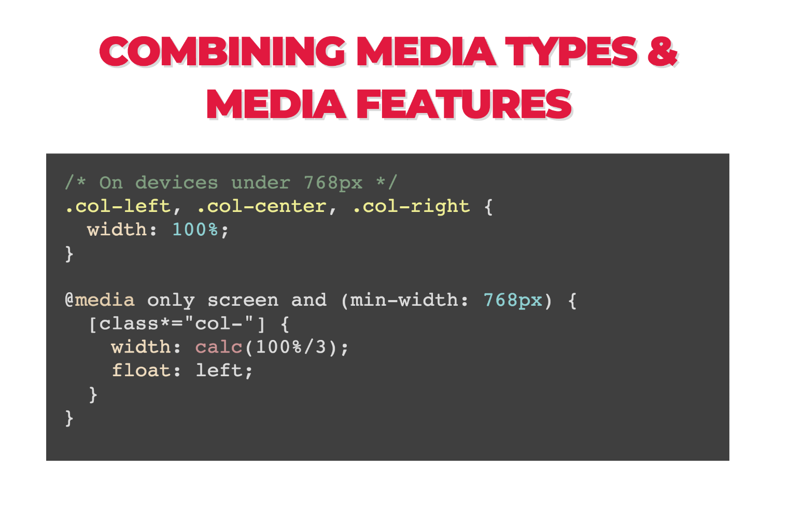

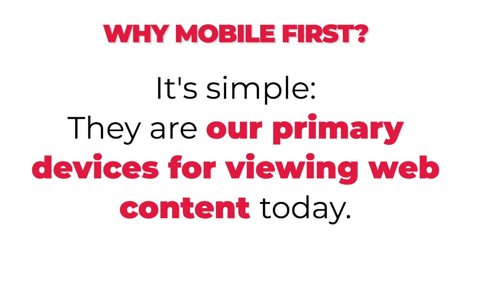

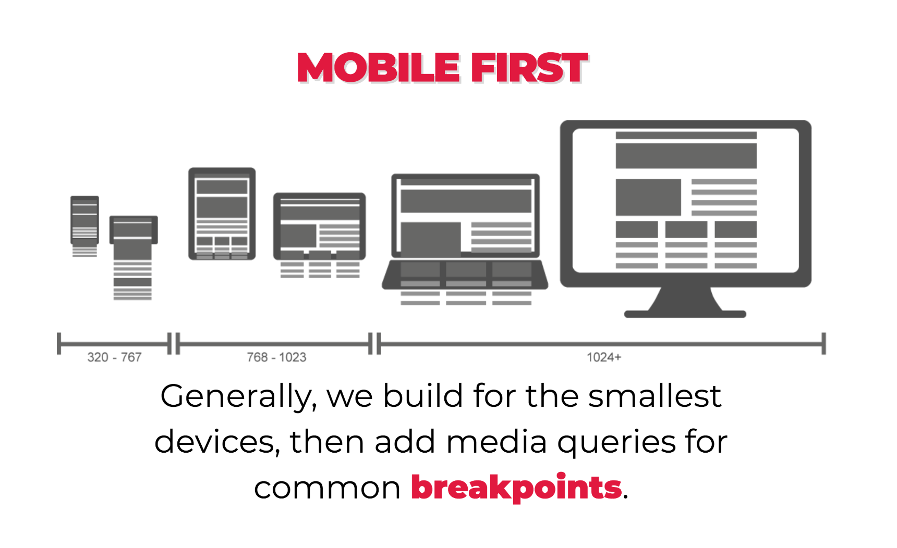

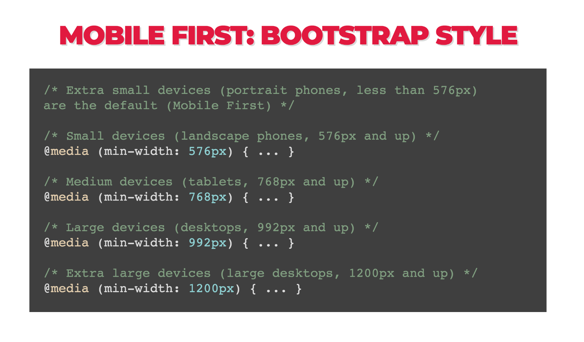

## What are the most common dimensions for a website design?

Why don't you tell me! http://screensiz.es

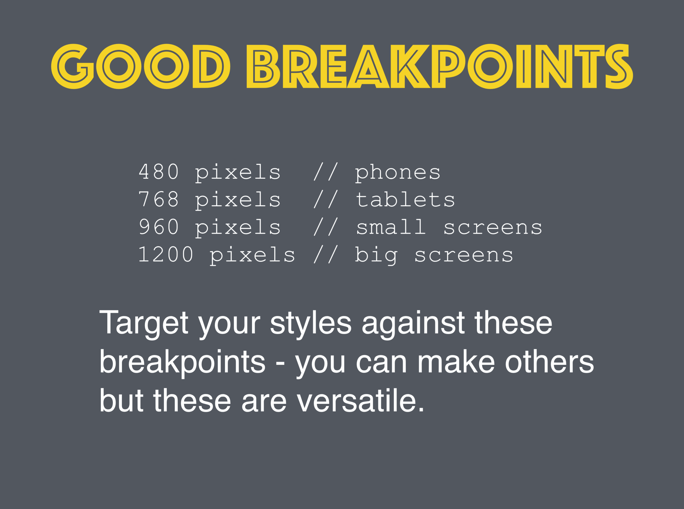

|  Unit  |  Description  |   Usage  |
|:----------:|:----------------:|:------------:|
|   px   | Referred to as absolute units because px (pixel) units will always be the same size regardless of any other related settings. | Most frequently with font sizes, margins, padding, max- and min- properties. |
|  em, rem | Relative to the current element's font-size (em), or the _root_ font-size (rem). When used to set the font-size of an element, em is relative to the element's inherited size. | Most frequently with font sizes, margins, padding, widths or heights that may need to be changed but remain relative to other elements. |
|  vh, vw  | Relative to the viewport width (vw), where one unit is equal to 1/100th of the viewport's current width, or the viewport height (vh), where one unit is equal to 1/100th of the viewport's current height. | Most frequently with width and height of structural page elements. Commonly used in responsive design. |
|   %   | Percentages are relative values. What the percentage is relative to, is determined by the property associated with the percentage value. | Most often used with width. Can be helpful to approximate intrisic sizing. |


#### Examples of non-responsive sites:

It is becoming harder and harder to find non-responsive websites. But here is an example 
of a [non-responsive 
website](https://dequeuniversity.com/library/responsive/1-non-responsive) for you to try 
out.

#### Examples of mobile specific sites:
One way to create optimal experiences for mobile users is a dedicated mobile site.

You know you're on one when you see `m.` in the url!

Compare https://m.xkcd.com with https://xkcd.com


Avoid these... please.

#### Examples of responsive sites:

- [Boston Globe](http://www.bostonglobe.com/)  
- [GA](https://generalassemb.ly/)
- [Responsive Meme](http://responsivememe.webflow.io/)


What's the difference between these? Let's resize again.
Interestingly, **Boston Globe was the first example of a responsive website.**

Instead of manually resizing the page, which can be a pain, we can use Google Chrome 
DevTools.


**Chrome DevTools in Action:**

- Let's visit GA's homepage
- Click on the device icon next to the magnifying glass
- You can change the pixel width (displayed at the top) using the drag tool
- You can select any device using the dropdown menu at the top


## Make a responsive website - Codealong

- [Static](examples/static)
- [Responsive](examples/responsive)
- [Media Queries](examples/mobile)

## Flexible Images

We need images that fit their containers.  By default, images will try to take up as much 
space as it's initial dimensions. This can cause some pain when you size up and size down 
your picture, especially if you are trying to control the size of your elements via a 
parent `div`.

It turns `max-width: 100%` is the answer. Most of the time. For any media.

Even as our flexible container resizes, shrinking or enlarging our image, the image’s 
aspect ratio remains intact.

```css
img,
embed,
object,
video {
  max-width: 100%;
  height: auto;
}
```

## Additional Resources

- https://learn.shayhowe.com/advanced-html-css/responsive-web-design/
- https://www.smashingmagazine.com/2011/01/guidelines-for-responsive-web-design/
- https://responsivedesign.is/guidelines/